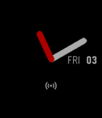
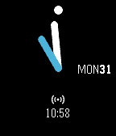

# TicTocPlus

A simple implementation of TicToc + day/date + Bluetooth Status watchface for Pebble Time.  Options: enable outer circle, show digital clock and a new blue theme.

You can install it from the Pebble Store:

http://apps.getpebble.com/en_US/application/5593fdad327b5ad0e2000046

Credits:

https://github.com/pebble-examples/ks-clock-face

http://en.uptodown.com/
